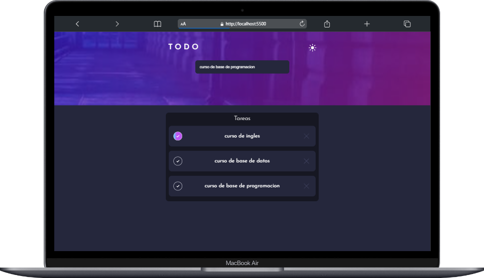

# Curso Intermedio de POO (ToDo List)

**Este proyecto consiste en un Gestor de tareas en el cual podras agregar una tarea nueva, marcar una tarea como completa y eliminar una tarea.**

**Para este Gestor se involucraron temas vistos es el curso Intermedio de Programacion Orientada a Objetos.**

**En el codigo podras ver como se utilizo el tema de clases y creacion de objetos con base las clases. Y tambien metodos que involucran acciones de cada tarea como lo es: el marcar o desmaracar una tarea y poder eliminarla.**

## Tecnologias:
- **HTML**
- **CSS**
- **JavaScript**

